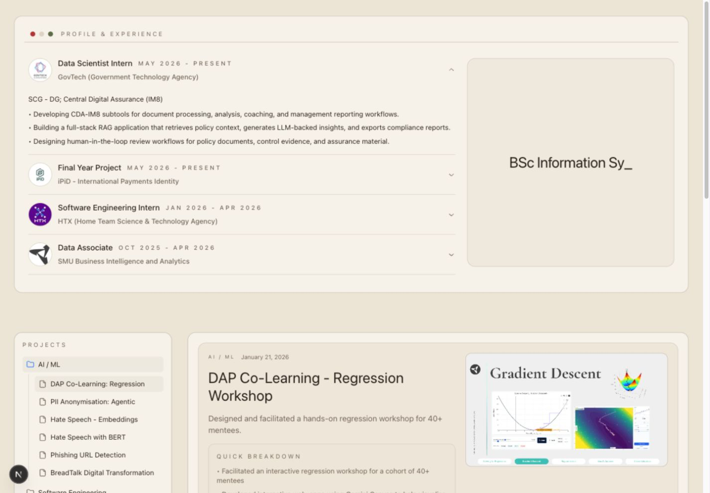
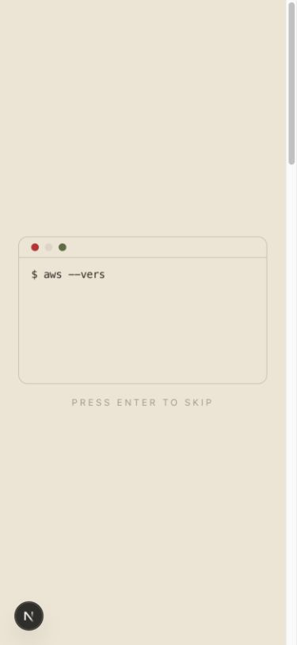

# Portfolio Redesign Audit

**Date:** 2026-09-05
**Status:** Findings recorded; implementation completed through OpenSpec
**OpenSpec change:** [`prioritize-internships-and-simplify-portfolio`](../openspec/changes/prioritize-internships-and-simplify-portfolio/proposal.md)

## Document Role

This document records the dated research, measurements, and code observations that motivated the redesign. The linked OpenSpec change is the source of truth for current scope, behaviour, architecture, and tasks. If this audit and OpenSpec disagree, OpenSpec governs.

## Reference Material

- Live portfolio: <https://bidyut.cc/>
- Template repository: <https://github.com/bidyut10/portfolio-template-one>
- Reviewed template commit: [`8a115ca`](https://github.com/bidyut10/portfolio-template-one/commit/8a115ca2bebfd424111770d6ceb422d8070f69f5)
- Template conventions: <https://github.com/bidyut10/portfolio-template-one/blob/main/CLAUDE.md>
- Motion migration guidance: <https://motion.dev/docs/react-upgrade-guide>

The live portfolio and the template repository represent different implementations. The live site has a long editorial layout with side navigation, large project images, certificates, skills, and status information. The template presents a compact single-column portfolio designed to fit within one desktop screen.

## Component Stack Findings

### Reference template

The template does not use a component library. Its runtime dependencies are:

- Next.js
- React and React DOM
- Motion
- Lucide React

Tailwind CSS v4 supplies styling. The repository implements the popover, accordion, theme switcher, locale switcher, and project rows as local React components.

The template contains 15 TypeScript or TSX files and about 1,046 lines of TypeScript/TSX. It declares five runtime dependencies and six development dependencies.

### Current portfolio

The current portfolio has a shadcn-style setup in [`components.json`](../components.json), with Magic UI and Kibo UI registries. The active code combines:

- shadcn and Radix primitives
- local UI components
- a Ruixen tree component
- Magic UI-style animation components
- both `framer-motion` and `motion`

The repository contains:

- 105 TypeScript or TSX files
- about 9,240 TypeScript/TSX lines
- 88 runtime dependencies and five development dependencies
- 52 files under `src/components/ui`
- 34 UI files with no static backlinks
- 10 top-level components with no static backlinks

The project needs more code than the reference because it supports twelve MDX case studies, Open Graph generation, analytics, Wordle, and Capoo. The copied UI surface still exceeds the needs of the portfolio.

## Visual and Navigation Findings

### First visit

[`terminal-loader.tsx`](../src/components/terminal-loader.tsx) blocks the portfolio with a staged animation. The fallback ends after nine seconds, although a visitor can press Enter or click a skip control.

The loader delays the information a recruiter needs:

- Name and professional positioning
- Recent internships
- Projects
- Contact links

### Desktop

At a 1440 by 1000 viewport, the settled first screen starts with the experience card and shows part of the project browser. The page does not present Shariff's name, professional summary, or contact links as stable content near the top.

The visual design nests several bordered, rounded surfaces. The experience panel contains an accordion and typing panel. The project section contains a folder tree, a selected-project card, a quick-breakdown card, and two more project cards. Each layer competes for attention.

### Mobile

At a 390 by 844 viewport, the terminal fills the first screen during its sequence. After it exits, the first viewport contains the typing panel and part of the first internship. Projects and contact links require substantial scrolling.

The mobile document measured about 3,258 CSS pixels in the local check. The design hides the project tree's folder expansion on mobile, but the component still computes folder, selection, and viewport state.

### Reference qualities to adopt

- A narrow reading column
- Stable identity and contact links at first paint
- Flat rows separated by subtle rules
- Short descriptions with evidence
- Restrained type and spacing scales
- A warm neutral foreground hierarchy without green or teal metadata accents
- Few rounded containers
- Progressive disclosure for experience details
- Project images that support a project rather than dominate navigation

## Code Findings

### Blocking terminal introduction

**Severity:** High
**Location:** [`src/components/terminal-loader.tsx`](../src/components/terminal-loader.tsx), [`src/components/terminal-loader-wrapper.tsx`](../src/components/terminal-loader-wrapper.tsx), [`src/app/(main)/layout.tsx`](<../src/app/(main)/layout.tsx>)

The main layout mounts the loader over each route in the route group. Visitors must wait or skip before they can use the page.

**Correction:** Remove the loader from the main layout. Retain a terminal experiment only as an optional Playground item if it still represents Shariff's interests.

### Missing stable identity block

**Severity:** High
**Location:** [`src/components/home-hero.tsx`](../src/components/home-hero.tsx)

The hero stores internship content and renders a rotating typing animation. It does not provide a stable introduction or primary links.

**Correction:** Replace the typing panel with a server-rendered identity block containing the name, role, one short positioning statement, GitHub, LinkedIn, and email. Keep the résumé private rather than publishing a file or link.

### Project browser state

**Severity:** High
**Location:** [`src/components/projects-tree-view.tsx`](../src/components/projects-tree-view.tsx)

The 328-line component maintains selected folder, selected project, viewport state, six memoized derivations, recursive tree data, and several project representations.

**Observed smell:** Speculative generality and duplicate presentation paths.

**Correction:** Render four featured project rows on the homepage, followed by compact older-project links that complete the directory. Each row opens its root-level MDX case study directly; omit a competing all-projects page and hover previews.

### Duplicate project routes

**Severity:** Medium
**Location:** [`src/app/(main)/[projectSlug]/page.tsx`](<../src/app/(main)/[projectSlug]/page.tsx>), [`src/app/(main)/[...slug]/page.tsx`](<../src/app/(main)/[...slug]/page.tsx>)

Both routes load the same project collection and generate the same twelve root-level paths. Their metadata implementations have started to diverge.

**Observed smell:** Duplicate code and two owners for one route contract.

**Correction:** Keep `[projectSlug]` as the canonical detail route and remove the catch-all route. This preserves existing public project URLs.

### Split content ownership

**Severity:** Medium
**Location:** [`src/components/home-hero.tsx`](../src/components/home-hero.tsx), [`src/config/site.ts`](../src/config/site.ts), [`content/projects`](../content/projects)

Experience lives inside a component, site identity lives in configuration, and project metadata lives in MDX. Components currently own copy that other views may need.

**Observed smell:** Shotgun surgery and misplaced data ownership.

**Correction:** Keep site metadata and links in `src/config/site.ts`, move profile and experience copy to `src/content/profile.ts`, and keep project metadata and bodies in MDX. Add homepage curation fields to project frontmatter rather than duplicating project data in a second configuration file.

### Animation packages

**Severity:** Medium
**Location:** [`src/components/ruixen/tree-node-tooltip.tsx`](../src/components/ruixen/tree-node-tooltip.tsx), [`src/components/ui`](../src/components/ui), [`package.json`](../package.json)

One component imports `framer-motion`. Four UI files import `motion/react`. The official Motion upgrade guide directs React projects to uninstall `framer-motion`, install `motion`, and switch imports to `motion/react`.

**Correction:** Removing the project tree will remove the only current `framer-motion` import. Delete `framer-motion` after a repository search confirms that no imports remain. Search for `motion/react` after removing the terminal and typing components; delete `motion` if the search returns no production consumer.

### Unused scaffold code

**Severity:** Medium
**Location:** [`src/components`](../src/components), [`src/types/index.d.ts`](../src/types/index.d.ts), [`components.json`](../components.json)

Static searches found 34 UI files and 10 top-level component files with no backlinks. The type declarations still include Prisma subscriptions, dashboard navigation, and documentation structures that do not belong to the portfolio.

**Correction:** Remove support files made dead by the homepage replacement in this change. Audit unrelated dashboard, documentation, subscription, Prisma, and NextAuth scaffolding in a separate change with its own caller checks.

## Validation Baseline

On 2026-09-05:

- `npm run lint` passed.
- `npm run build` passed outside the restricted sandbox.
- The build generated 18 routes.
- The build generated every project through both `[projectSlug]` and `[...slug]`, confirming the duplicate route path.
- No automated test files or test-runner configuration were found.
- Velite reported an empty body in `content/authors/shariff-rashid.mdx`.
- Browserslist reported data that was ten months old.

## Reference Repository Handling

A committed clone would add stale source, duplicate ownership, and licensing housekeeping to this repository. The implementation can refer to the pinned GitHub commit and the conventions listed above.

If an implementation task needs exact component code, use a temporary shallow clone outside the repository:

```bash
git clone --depth 1 https://github.com/bidyut10/portfolio-template-one.git /tmp/portfolio-template-one
```

Copy a pattern only after adapting it to this portfolio's content model and accessibility requirements. The reference has one commit, no test suite, and no CI configuration, so it should remain a design reference.

## Baseline captures

These captures preserve the pre-redesign homepage after its terminal sequence, at the same desktop and mobile reference sizes used for final review.

### Desktop baseline



### Mobile baseline



## Accessibility follow-up

The post-redesign review uses WCAG 2.2 AA as its practical baseline. It covers the portfolio shell, homepage, project route, Capoo, and Wordle. Automated checks are a safety net rather than proof of conformance; VoiceOver, keyboard-only use, zoom/reflow, and content-quality checks remain appropriate before treating the site as fully audited.

### Resolved findings

- **Label in name:** The visible `SR` home mark was overridden by `aria-label="Shariff Rashid, home"`. Its accessible name now begins with the visible text and continues with the owner and destination. This follows [WCAG 2.5.3](https://www.w3.org/WAI/WCAG22/Understanding/label-in-name.html).
- **Navigation and focus:** The skip link targets a programmatically focusable `main` landmark. Links, buttons, and experience disclosures share a high-contrast visible focus treatment. External GitHub and LinkedIn links announce that they open a new tab.
- **Color and contrast:** Primary text, muted text, and focus-ring contrast against the page background measure approximately 14.13:1, 4.96:1, and 10.05:1. Wordle's white-on-result colors were raised from approximately 2.38:1 and 2.01:1 to approximately 5.02:1, and shape markers now repeat the result meaning so color is not the only cue. This follows [WCAG 1.4.1](https://www.w3.org/WAI/WCAG22/Understanding/use-of-color.html).
- **Status and control state:** Wordle exposes turn and outcome changes as polite status messages, gives its instructions control `aria-expanded` and `aria-controls`, prevents document-level keyboard shortcuts from double-triggering focused controls, and uses native disabled states for unavailable keys. This follows [WCAG 4.1.3](https://www.w3.org/WAI/WCAG22/Understanding/status-messages.html).
- **Non-text content:** Capoo exposes one concise text alternative while removing its infinitely repeated ASCII characters from the accessibility tree. Adjacent company logos remain decorative, the profile portrait is described, and all 36 MDX `Image` blocks provide an `alt` attribute. This follows [WCAG 1.1.1](https://www.w3.org/WAI/WCAG22/Understanding/non-text-content.html).

### Manual follow-up

- Complete one VoiceOver and Safari pass through the home mark, navigation, experience disclosures, Wordle board, and result message.
- Check reflow at 200% and 400% zoom, especially the expanded HTX name and project tables.
- Review whether each project image's alternative describes the information conveyed rather than merely satisfying the presence of an `alt` attribute.
- Inspect text embedded inside project screenshots separately; HTML checks cannot assess contrast or reading order inside raster images.
