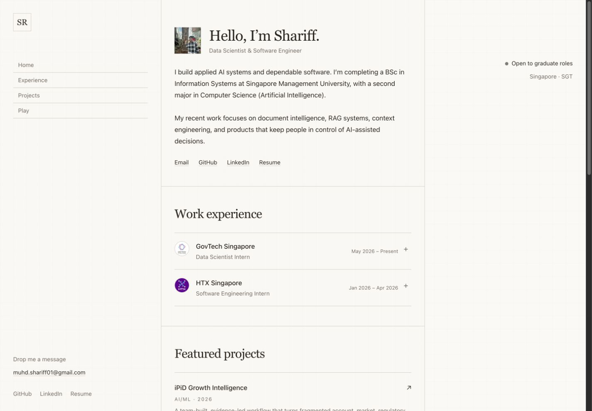
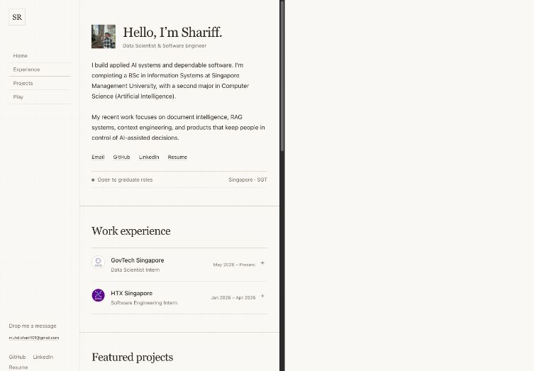
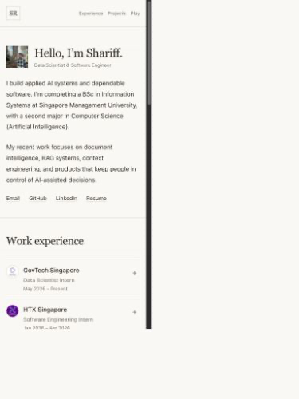
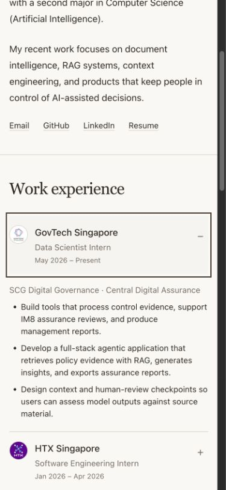
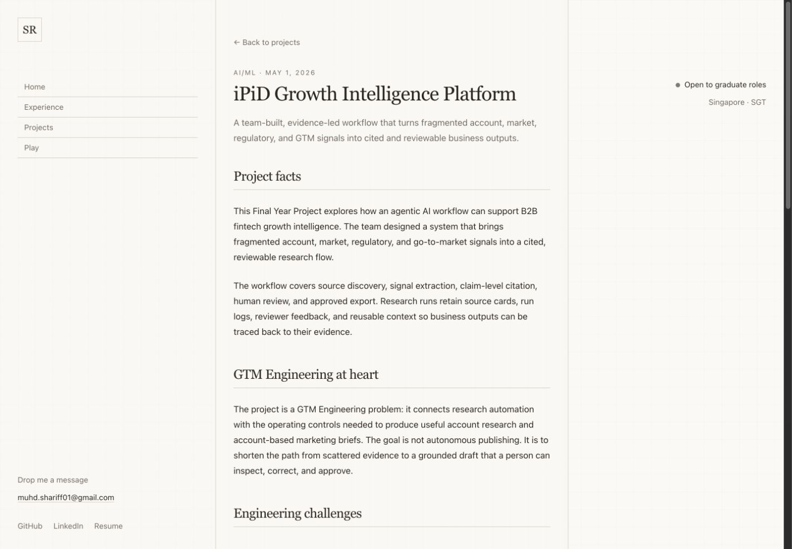
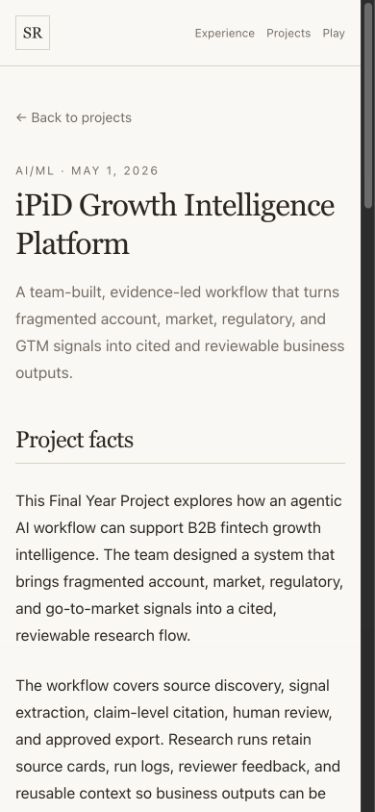

# Portfolio Target Screen Mockups

**Date:** 2026-09-05
**Status:** Target layout and final rendered screenshots complete
**OpenSpec change:** [`prioritize-internships-and-simplify-portfolio`](../openspec/changes/prioritize-internships-and-simplify-portfolio/proposal.md)
**Audit:** [`2026-09-05-portfolio-redesign-audit.md`](./2026-09-05-portfolio-redesign-audit.md)

**Document role:** This is a supporting visual appendix. The linked OpenSpec change is authoritative for scope, behaviour, architecture, and tasks. If a diagram conflicts with OpenSpec, OpenSpec governs and this document should be corrected.

## Direction

The desktop portfolio uses the three-column editorial shell from the live Bidyut reference:

- A persistent navigation and contact rail on the left
- A narrow reading column for profile, work, and project content
- A compact status rail on the right

Fine grid lines align headings, rows, and controls across the viewport. The main column follows a resume structure: GovTech and HTX as work experience, four featured projects led by iPiD and the SMU BIA project, then an older-projects list.

On mobile, the left rail becomes a top navigation bar. The right rail drops out, and the content uses one column. The layout needs no menu drawer.

## Site Map

```text
/
|-- profile and contact
|-- work experience
|   |-- GovTech
|   `-- HTX
|-- featured projects
|   |-- iPiD FYP -> /ipid-growth-intelligence
|   |-- SMU BIA hate-speech project -> /hate-speech-dap
|   |-- PII anonymiser -> /pii-anonymisation-gen-ai
|   `-- BERT and LoRA study -> /hate-speech-classification
|-- older projects
|   `-- /<project-slug>
`-- Playground
    |-- /capoo
    `-- /wordle

/<project-slug>
`-- existing MDX case study
```

## Visual Rules

- Use a warm neutral background and a charcoal hierarchy; dates, categories, focus rings, and small labels do not use green or teal.
- Use low-contrast dotted grid lines to align sections.
- Separate rows with rules and spacing instead of nested cards.
- Avoid fake window chrome, icon clouds, and a blocking introduction.
- Use a serif display face for major headings and a plain sans-serif face for body copy.
- Keep case-study text between 60 and 72 characters per line.
- Show text labels for navigation and contact links.
- Use CSS for hover, focus, and underline changes.
- Use native `details` elements for work-experience disclosure and omit project previews in the first release.

## Desktop Shell

**Reference viewport:** 1440 x 1000
**Outer frame:** up to 1360 px
**Columns:** `minmax(240px, 1fr) minmax(0, 640px) minmax(240px, 1fr)`

```text
+----------------------------+------------------------------------------------------+----------------------------+
| LEFT RAIL                  | MAIN READING COLUMN                                  | RIGHT RAIL                 |
|                            |                                                      |                            |
| [SR mark]                  | [portrait]  Hello, I'm Shariff.                      | Open to work            o  |
|                            |             Data Scientist & Software Engineer       | Singapore  16:20 SGT       |
| Home                       |                                                      |                            |
| Experience                 | Short introduction and current focus.                |                            |
| Projects                   |                                                      |                            |
| Playground                 | GovTech                                               |                            |
|                            | HTX                                                   |                            |
|                            |                                                      |                            |
|                            | Featured projects                                    |                            |
|                            | Project rows                                          |                            |
|                            |                                                      |                            |
|                            | Older projects                                       |                            |
|                            | Compact title and year rows                          |                            |
|                            |                                                      |                            |
| Drop me a message          | Footer note                                           |                            |
| email address              |                                                      |                            |
| GitHub LinkedIn Resume     |                                                      |                            |
+----------------------------+------------------------------------------------------+----------------------------+
```

The page scrolls as one document. Each side rail uses `position: sticky` within its column. The central column sets the reading order, so a screen reader can understand the work without visiting either rail.

### Grid treatment

- Draw vertical column boundaries and 32 px horizontal guides with CSS backgrounds and borders.
- Keep the grid visible at desktop and tablet widths.
- Keep the grid decorative and non-interactive; do not expose a grid-mode switch.
- Lower the grid contrast on mobile.

## Desktop Homepage

### First viewport

```text
+--------------------------+--------------------------------------------------------+--------------------------+
|                          |                                                        |                          |
|                          |  [avatar]  Hello, I'm Shariff.                         |                          |
|                          |            Data Scientist & Software Engineer          |                          |
|                          |                                                        |                          |
| [SR]                     |  I build applied AI systems and dependable software.   | Open to work          o  |
|                          |  I'm completing a BSc in Information Systems at SMU.   | Singapore  16:20 SGT     |
| Home                     |                                                        |                          |
| Experience               |  My current work focuses on document intelligence,    |                          |
| Projects                 |  RAG systems, and products that support human review.  |                          |
| Playground               |  Experience                                            |                          |
|                          |                                                        |                          |
|                          |  (G) GovTech Singapore             May 2026 - Present  |                          |
|                          |      Data Scientist Intern                          >  |                          |
|                          |--------------------------------------------------------|                          |
|                          |  (H) HTX Singapore                Jan 2026 - Apr 2026  |                          |
|                          |      Software Engineering Intern                    >  |                          |
|                          |                                                        |                          |
| Drop me a message        |  Featured projects                                     |                          |
| shariff@[confirmed]      |  iPiD Growth Intelligence Platform                 ->  |                          |
| GitHub LinkedIn Resume   |  FYP / 2026                                             |                          |
+--------------------------+--------------------------------------------------------+--------------------------+
```

Both rows start collapsed. The visitor can open either row with Enter or Space, and the trigger keeps focus. One default works at each viewport and needs no screen-size state.

### Remaining homepage

```text
+--------------------------+--------------------------------------------------------+--------------------------+
| Home                     |  Featured projects                                     | Open to work          o  |
| Experience               |                                                        | Singapore  16:20 SGT     |
| Projects                 |  iPiD Growth Intelligence Platform                 ->  |                          |
| Playground               |  Cited account research and grounded ABM briefs.       |                          |
|                          |--------------------------------------------------------|                          |
|                          |  SMU BIA: Hate Speech and Embedding Analysis        ->  |                          |
|                          |  AI/ML / 2025                                          |                          |
|                          |  Frozen embeddings and XGBoost reached 70.3%.          |                          |
|                          |--------------------------------------------------------|                          |
|                          |  Privacy-Focused Agentic Anonymiser                ->  |                          |
|                          |  GenAI with LLMs / 2025                                |                          |
|                          |  Local multi-agent anonymisation improved to 97%.       |                          |
|                          |--------------------------------------------------------|                          |
|                          |  Hate Speech Classification with BERT              ->  |                          |
|                          |  GenAI with LLMs / 2025                                |                          |
|                          |  RoBERTa full fine-tuning reached Macro F1 0.689.       |                          |
|                          |                                                        |                          |
| Drop me a message        |  Older projects                                        |                          |
| shariff@[confirmed]      |  2025  Aircraft Delay Analysis                     ->  |                          |
| GitHub LinkedIn Resume   |  2025  CampusG / Phishing Detection / 6 more       ->  |                          |
+--------------------------+--------------------------------------------------------+--------------------------+
```

Project rows stay flat and use no hover preview.

## Mobile Shell

**Reference viewport:** 390 x 844
**Columns:** one
**Gutters:** 16 px

The top bar contains the home-linked mark on the left and three section links on the right: `Experience`, `Projects`, and `Play`. The profile is the homepage, so an About item would duplicate the mark's Home action. The top bar remains in normal document flow while the visitor scrolls.

```text
+------------------------------------------+
| [SR]       Experience  Projects  Play    |
|------------------------------------------|
|                                          |
| [avatar]  Hello, I'm Shariff.            |
|           Data Scientist &               |
|           Software Engineer              |
|                                          |
| I build applied AI systems and           |
| dependable software. I'm completing a    |
| BSc in Information Systems at SMU.       |
|                                          |
| My current work focuses on document      |
| intelligence, RAG systems, and products  |
| that support human review.               |
|                                          |
| Drop me a message                        |
| shariff@[confirmed]                      |
| GitHub  LinkedIn  Resume                 |
|                                          |
| Experience                               |
|------------------------------------------|
| (G) GovTech Singapore                    |
|     Data Scientist Intern                |
|     May 2026 - Present                 > |
|------------------------------------------|
| (H) HTX Singapore                        |
|     Software Engineering Intern          |
|     Jan 2026 - Apr 2026                > |
+------------------------------------------+
```

Both internships start collapsed on mobile. Opening a row inserts a compact, full-width evidence block beneath the summary without retaining an empty logo-column indent or moving focus.

### Remaining mobile flow

```text
+------------------------------------------+
| Featured projects                         |
|------------------------------------------|
| iPiD Growth Intelligence Platform      ->|
| FYP / 2026                               |
| Cited research and grounded ABM briefs. |
|------------------------------------------|
| SMU BIA: Hate Speech and Embeddings    ->|
| AI/ML / 2025                             |
| XGBoost with frozen embeddings: 70.3%.  |
|------------------------------------------|
| Privacy-Focused Agentic Anonymiser     ->|
| GenAI with LLMs / 2025                   |
| Local multi-agent workflow reached 97%. |
|------------------------------------------|
| Hate Speech Classification with BERT   ->|
| GenAI with LLMs / 2025                   |
| Full fine-tuning and LoRA comparison.   |
|                                          |
| Older projects                           |
|------------------------------------------|
| 2025  Aircraft Delay Analysis          ->|
| 2025  CampusG Food Delivery            ->|
| 2025  Phishing URL Detection           ->|
| 2025  Software Project Management      ->|
| 2025  ESMOS Cloud Migration            ->|
|------------------------------------------|
| Playground: Capoo / Wordle               |
| (c) 2026 Shariff Rashid                  |
+------------------------------------------+
```

Mobile omits the right status rail and project preview images. Featured and older rows together expose every published project. Each row is one link target that opens its case study directly and shows a neutral focus outline.

## Project Case Study

**Route:** `/<project-slug>`
**Source:** existing project MDX

The project page keeps the global shell and replaces the main column. The case-study body uses a 60 to 72 character reading measure.

### Desktop

```text
+--------------------------+--------------------------------------------------------+--------------------------+
| [SR]                     |  <- Back to projects                                   | Open to work          o  |
|                          |                                                        | Singapore  16:20 SGT     |
| Home                     |  iPiD Growth Intelligence Platform                     |                          |
| Experience               |  FYP / 2026 / Team project                             |                          |
| Projects                 |                                                        |                          |
| Playground               |  review trails, and grounded business outputs.         |                          |
|                          |                                                        |                          |
|                          |  Project facts                                         |                          |
|                          |  GTM Engineering context                              |                          |
|                          |  Engineering challenges                               |                          |
|                          |  Pseudocode                                             |                          |
| Contact                  |                                                        |                          |
| GitHub LinkedIn          |  <- Back to projects                                   |                          |
+--------------------------+--------------------------------------------------------+--------------------------+
```

### Mobile

```text
+------------------------------------------+
| [SR]       Experience  Projects  Play    |
|------------------------------------------|
| <- Back to projects                      |
|                                          |
| iPiD Growth Intelligence                 |
| Platform                                 |
| FYP / 2026 / Team project                |
|                                          |
| Agentic research with cited sources and  |
| reviewable business outputs.             |
|                                          |
| Project facts                            |
| GTM Engineering context                  |
| Engineering challenges                   |
| Pseudocode                               |
|                                          |
| <- Back to projects                      |
+------------------------------------------+
```

The iPiD note has no product image, interface capture, repository action, live demo, or previous/next navigation. It uses neutral team-level language and only approved facts. Other project pages may retain images already approved in their MDX. Figures fit the content width, while tables and pseudocode blocks own their scroll region so the page does not scroll sideways.

## Responsive Contract

| Element         | Mobile, 320-767 px     | Tablet, 768-1099 px | Desktop, 1100 px and above      |
| --------------- | ---------------------- | ------------------- | ------------------------------- |
| Shell           | Top bar and one column | Left rail and main  | Left rail, main, and right rail |
| Navigation      | Non-sticky top bar     | Sticky left rail    | Sticky left rail                |
| Status          | Omitted                | Row under profile   | Sticky right rail               |
| Contact         | Profile block          | Left rail           | Left rail                       |
| Internships     | Collapsed at load      | Collapsed at load   | Collapsed at load               |
| Project preview | Omitted                | Omitted             | Omitted                         |
| Project body    | Full width             | Up to 640 px        | Up to 640 px                    |

## Content Inputs

At planning time, the repository lacked a public resume URL and email address. The implementation adds both to `src/config/site.ts` and derives the introduction and availability text from the current resume material.

Create the iPiD MDX entry from approved FYP material before adding its homepage link. Keep it to verified team-level facts, its GTM Engineering purpose, engineering challenges, and pseudocode. Do not display the product, product UI, demo, repository, proprietary code or data, or unsupported personal-contribution claims. Update `hate-speech-dap.mdx` from the richer SMU BIA project source in the sibling `../resume-refs` repository, which contains measured results missing from the portfolio copy.

Use one optional `homepageOrder` frontmatter field. Values 1 through 4 select and order the featured projects. Published entries without that field appear in the older-projects list. Together, both homepage lists expose every published project and link directly to root-level case studies.

## Final Render Capture

Add these captures after implementation:

| Screen                     | Viewport    | Expected file                                                        |
| -------------------------- | ----------- | -------------------------------------------------------------------- |
| Homepage desktop           | 1440 x 1000 | `docs/assets/portfolio-redesign/home-desktop.png`                    |
| Homepage tablet            | 768 x 1024  | `docs/assets/portfolio-redesign/home-tablet.png`                     |
| Homepage mobile            | 390 x 844   | `docs/assets/portfolio-redesign/home-mobile.png`                     |
| Mobile experience expanded | 390 x 844   | `docs/assets/portfolio-redesign/home-mobile-experience-expanded.png` |
| Project case study desktop | 1440 x 1000 | `docs/assets/portfolio-redesign/project-detail-desktop.png`          |
| Project case study mobile  | 390 x 844   | `docs/assets/portfolio-redesign/project-detail-mobile.png`           |

Compare each render with the shell, content order, and viewport rules above. Record each intentional difference beside its capture.

## Final rendered screens

The implementation follows the OpenSpec shell and reading order. Final captures use the requested viewports; the in-app browser reserves 15 pixels for its scrollbar, so the rendered content width is correspondingly smaller where a vertical scrollbar appears.

### Homepage desktop — 1440 × 1000



### Homepage tablet — 768 × 1024



### Homepage mobile — 390 × 844



Intentional differences from the ASCII target:

- The status copy says “Open to graduate roles,” which is more precise than the generic “Open to work.”
- The status rail shows `Singapore · SGT` without a clock. This keeps the shell server-rendered and avoids a client-only timer for decorative information.
- Real profile and project summaries determine line wrapping; the hierarchy, project order, disclosure state, and breakpoint behaviour match the target.

### Mobile experience expanded — 390 × 844



The expanded evidence spans the content width beneath its summary and uses compact resume-style spacing. Projects remains a single homepage directory; there is no competing `/projects` index.

### iPiD case study desktop — 1440 × 1000



### iPiD case study mobile — 390 × 844



The final iPiD page intentionally contains no cover image, product interface, demo, repository action, product link, or previous/next navigation. Its longer title and evidence-led introduction wrap naturally while the case-study measure remains within the specified reading width.
